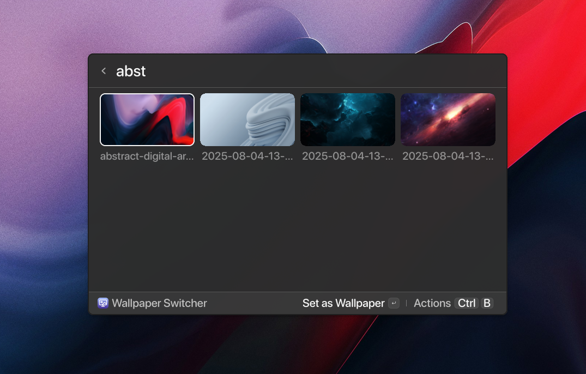

# Hyprpaper Switcher
**Browse and set wallpapers without leaving your launcher.**

A [Vicinae](https://docs.vicinae.com) extension that shows your wallpaper collection as a visual grid and applies the chosen image — automatically using the right backend for your session: **Hyprpaper** on Hyprland, **gsettings** on GNOME.



## Install
```bash
git clone https://github.com/z-Eduard005/hyprpaper-switcher
cd hyprpaper-switcher
npm install
npm run build
```

## Features
- 4-column wallpaper grid with search and full arrow-key navigation (wraps first ↔ last)
- Fully automatic backend: Hyprland → Hyprpaper config, GNOME → `picture-uri` + `picture-uri-dark`
- Configurable wallpaper folder (extension preferences, defaults to `~/.local/share/backgrounds`)
- Actions: **Set as Wallpaper**, **Open Image** (default viewer), **Open Wallpapers Folder**, **Configure Wallpaper Folder**